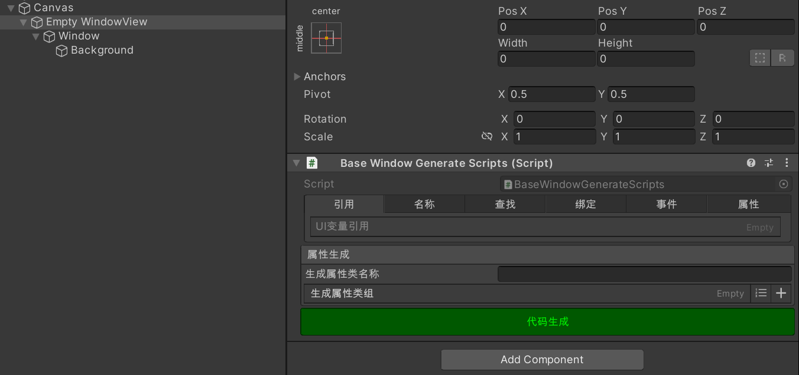
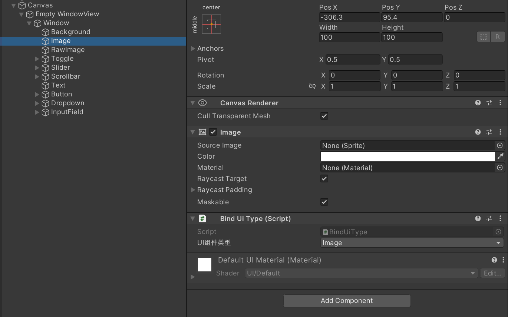
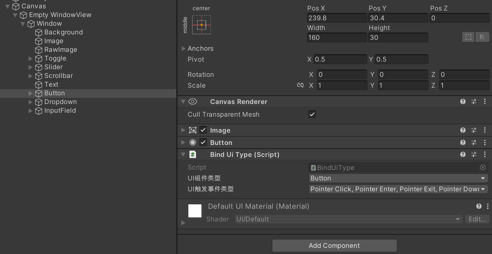
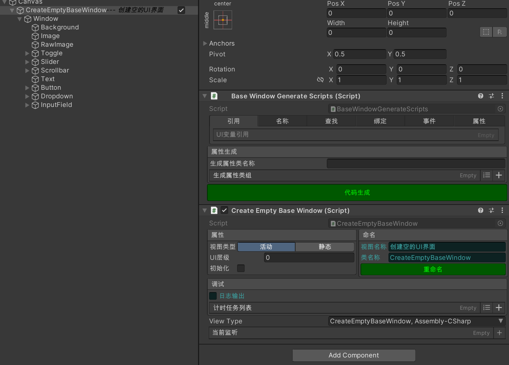
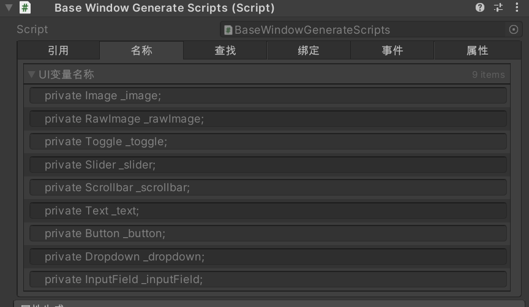

XFrame
===========================


### -----项目介绍-----
XFrame 是一个基于Unity引擎的插件,对常用的功能进行的封装,可以更方便快捷并且稳定的开发,适合小型游戏或虚拟仿真的开发


### 环境依赖

Odin - Inspector and Serializer 

插件地址:https://assetstore.unity.com/packages/tools/utilities/odin-inspector-and-serializer-89041

## 插件功能:

### 1.UI框架

实现功能：

1.UI模板快速生成

2.代码自动生成

3.UI组件快速绑定，并实现对应的监听

4.通过UI的Type类型快速操作

使用流程
1.Hierarchy 面板右击 Create Empty BaseWindow (如面板上没有Canvas组件会自动生成一个Canvas，默认大小为1920*1080)创建一个空的Empty WindowView GameObject
，该组件为最小的UI块



每次创建完会自动添加一个BaseWindowGenerateScripts的脚本，该脚本是为了实现代码生成

[引用] [名称] [查找] [绑定] [事件] [属性] 会在点击代码生成后显示预览内容，该内容与代码生成的内容一致

Window-窗口组件，所有的UI操作的都要放到该物体的子集中才可进行生成

Background-默认生成，可以删除，这里只是占位，可以快速的在Window下创建物体

2.编辑UI界面 可以添加Ugui自带的各种组件，(TestMeshPro也可使用)



添加UI组件后，可以选中对应的组件并按下Alt + V 键，可对当前UI组件添加对应的UI组件类型，这里类型为Image，UI组件类型即为Image，

事件类型有优先级顺序，如Button组件上带有Image组件，那么生成后默认为Button，如发现类型不是你想要的类型，可以手动更改

如找不到UI组件类型，会自动添加一个GameObject类型



Button为特殊类型，添加组件类型后，会多出一个UI触发事件类型，可以多选类型，选择几个类型在生成代码后会自动添加对应的事件,(已经添加的事件类型再生成后，取消该事件)
类型，再次生成会移除掉当前方法，会导致代码内容丢失， 如添加了Pointer Enter类型，并进行了代码生成，后又移除Pointer Enter，那Pointer Enter中的内容就会丢失，
即使再次添加生成后，内容依旧无法找回，推荐写法是封装函数方法，触发类型只做方法调用


[警告]要生成的组件名称必须符合代码书写规范，不能带有代码不可识别的内容(如空格 数字开头等)，并且同一层级UI不能出现两个相同名称，要保证生成的类型
的名称的唯一性

3.添加UI类 创建UI类和创建UI界面没有先后顺序
右击Project > Create > XFramework > C# BaseWindow 会创建BaseWindow的类型，创建好UI界面，可以拖拽到WindowView上



添加脚本到正确位置后Hierarchy面板的UI会显示√，表示当前UI是激活界面，手动点击√，可隐藏当前界面

视图类型 活动：当前视图会被全局操作时影响，静态则不会影响（如某些操作需要隐藏全部视图而又想显示某个视图界面可以把视图类型设为静态）

UI层级 热更时会根据这个UI层级进行重新排序

初始化 当UI被显示或隐藏操作时才会进行初始化(如某UI显示时才更新该视图的某些UI),当勾选该选项，一开始就会被初始化

视图名称 方便UI名称查找，只做为显示

类名称 当点击重命名后会把当前UI名称更改为与类名一致

日志输出 调试用，使用框架自带的Debug会根据此开关决定是否显示内容

ViewType 当前界面的Type类型，创建时默认添加，如发现该类型不存在，需要手动选择一次

当前监听 记录当前界面的监听数据

4.UI脚本 当基本功能添加完毕，点击代码生成，会根据当前UI组件进行编辑(详见第二部分)，并生成新的数据

BaseWindowGenerateScripts会显示当前生成的内容
```
#region 引入
using UnityEngine.UI;
using UnityEngine.EventSystems;
#endregion 引入

using System;
using System.Collections.Generic;
using Sirenix.OdinInspector;
using UnityEngine;
using XFramework;

public class CreateEmptyBaseWindow : BaseWindow
{
    #region 变量声明
    private Image _image;
    private RawImage _rawImage;
    private Toggle _toggle;
    private Slider _slider;
    private Scrollbar _scrollbar;
    private Text _text;
    private Button _button;
    private Dropdown _dropdown;
    private InputField _inputField;
    #endregion 变量声明

    public override void Init()
    {
    }

    protected override void InitView()
    {
        #region 变量查找
        BindUi(ref _image,"Image");
        BindUi(ref _rawImage,"RawImage");
        BindUi(ref _toggle,"Toggle");
        BindUi(ref _slider,"Slider");
        BindUi(ref _scrollbar,"Scrollbar");
        BindUi(ref _text,"Text");
        BindUi(ref _button,"Button");
        BindUi(ref _dropdown,"Dropdown");
        BindUi(ref _inputField,"InputField");
        #endregion 变量查找
    }

    protected override void InitListener()
    {
        #region 变量绑定
        _toggle.onValueChanged.AddListener(OnToggle);
        BindListener(_button,EventTriggerType.PointerClick,OnButtonClick);
        BindListener(_button,EventTriggerType.PointerEnter,OnButtonEnter);
        BindListener(_button,EventTriggerType.PointerExit,OnButtonExit);
        BindListener(_button,EventTriggerType.PointerDown,OnButtonDown);
        BindListener(_button,EventTriggerType.PointerUp,OnButtonUp);
        #endregion 变量绑定
    }

    #region 变量方法
    private void OnToggle(bool isOn)
    {
    }
    private void OnButtonClick(BaseEventData targetObj)
    {
    }
    private void OnButtonEnter(BaseEventData targetObj)
    {
    }
    private void OnButtonExit(BaseEventData targetObj)
    {
    }
    private void OnButtonDown(BaseEventData targetObj)
    {
    }
    private void OnButtonUp(BaseEventData targetObj)
    {
    }
    #endregion 变量方法

    #region 自定义属性

    #endregion 自定义属性
}
```
#region 引入 自动添加当前类型所需的引入

#region 变量声明 包含了当前的所有要生成的类型

#region 变量查找 对当前生成的类型进行查找

#region 变量绑定 对能触发类型的UI进行事件绑定

#region 变量方法 生成对应的绑定方法

#region 自定义属性 扩展属性

[警告] 除了#region 变量方法 中的方法体中的内容可以编辑，其他#region区域中的不要定义内容，当下次点击代码生成时，会覆盖#region内容


2.计时器-

普通定时器,循环定时器,与动画控制器结合,动画播放完毕后可调用事件

3.自定义打包(WebGl)其他未添加

4.场景一键化自动打包,自动加载(WebGl),如想把一个场景异步加载,只需点击一下设置场景为异步方式即可
 
5.音频配置,可视化音频管理,快速调用
 
6.事件托管--解耦
 
7.流程控制

8.实体控制-方便控制场景中的实体组件

9.下载服务

10.场景加载功能-异步与同步


其他小功能 场景漫游,一键动画分帧创建控制器,射线控制器,动画管理等